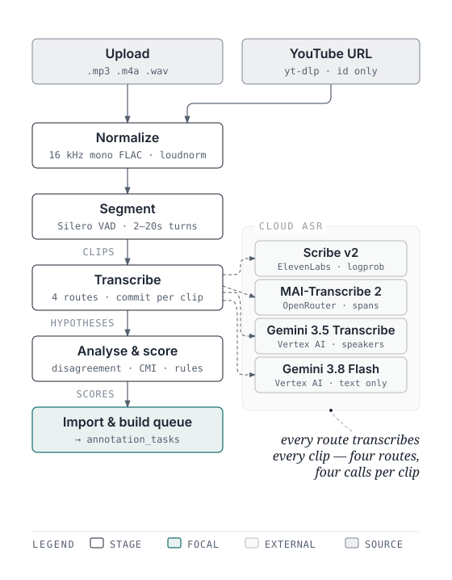
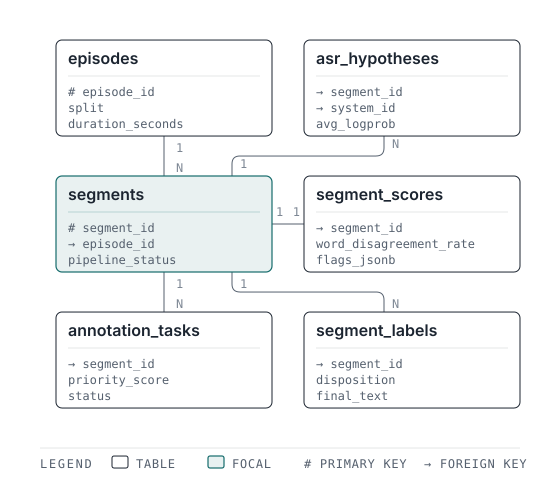
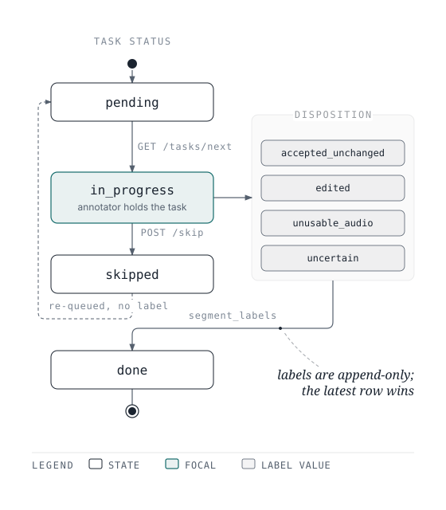
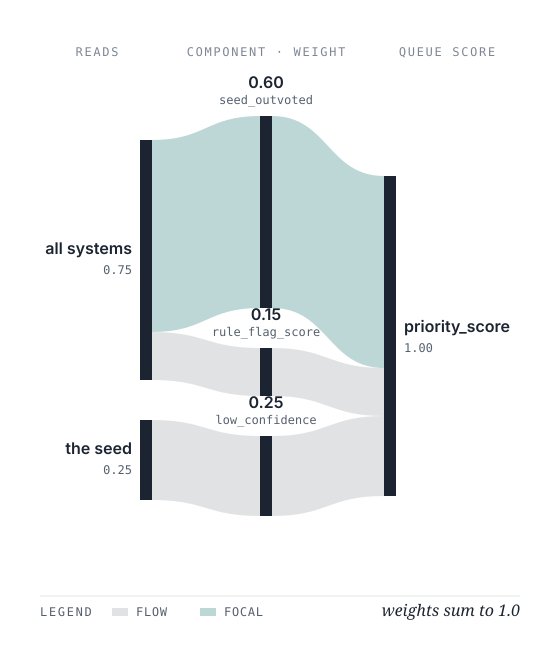

# Architecture

## System boundary



The harness provides an end-to-end web workflow: the annotator selects a podcast file directly in
the browser or pastes a YouTube URL, watches real-time progress and logs as it normalizes, segments,
and queries Cloud ASR, and immediately begins annotation in the Review UI without touching the CLI
or fragile Colab notebooks.

## Module map

```text
backend/app/
  config.py        YAML + env configuration, frozen pydantic models
  main.py          FastAPI application factory
  api/             HTTP routers (health, ingest, queue, tasks, segments, translit, episodes)
  db/              engine, session scope, declarative base
  models/          SQLAlchemy ORM models -- one module per concept group
  schemas/         JSON Schema for the manifest (episode.schema.json, segment.schema.json)
  services/        ingest pipeline (audio, silero_vad, analysis, youtube), importer, peaks,
                   scoring, queue builder, labeling, corpus, export, reporting
  storage/         ObjectStorage interface + local filesystem and MinIO implementations
  translit/        Latin -> Devanagari providers and the cache
  llm/             base (retry, dry-run, request log), openrouter, elevenlabs, and the
                   transcription dispatcher every ASR call in the pipeline goes through
  utils/           logging, hashing, time
scripts/           thin CLI wrappers over services
config/            settings.yaml, llm_routes.yaml
```

Import and queue building are pure functions over a batch with no global state, so moving them
behind a job queue later is a wiring change, not a rewrite.

## Input contract: the manifest

```text
export_<episode_id>/
  episode.json          object described by app/schemas/episode.schema.json
  segments.jsonl        one object per line, app/schemas/segment.schema.json
  clips/<segment_id>.flac    16 kHz mono FLAC, rejected otherwise
  peaks/<segment_id>.json    optional; generated at import when absent
```

Both files are validated against JSON Schema before a single row is written. Import is idempotent,
keyed on `segment_id` for segments and `(segment_id, system_id)` for hypotheses. A changed clip
checksum is an error unless `--allow-clip-change` is passed.

## Data model



Postgres is the source of truth. All timestamps are `timestamptz` in UTC.

### Provenance and content

| Table | Purpose |
|---|---|
| `import_runs` | One row per import invocation, with counts and status |
| `episodes` | Episode metadata plus the **frozen** train/val/test split |
| `segments` | Time span, clip and peaks object keys, `pipeline_status` |
| `asr_systems` | One row per upstream ASR system |
| `asr_hypotheses` | Immutable imported transcripts, one per (segment, system) |
| `hypothesis_words` | Optional word-level timings, languages and scripts; times are **clip-relative** (D26) |
| `segment_scores` | Imported agreement scores and rule flags, one row per segment |

### Annotation

| Table | Purpose |
|---|---|
| `annotation_tasks` | Queue rows with `priority_score`, `reason_jsonb`, `seed_hypothesis_id` |
| `label_versions` | Named label sets carrying a `policy_version` |
| `segment_labels` | Append-only human decisions; latest row per (segment, label_version) is current |
| `annotation_events` | Timing and action per interaction, for throughput measurement |
| `audit_logs` | Every write, with old and new values |
| `translit_cache` | Latin token -> ranked Devanagari candidates |
| `llm_requests` | Provider request log; every ASR attempt during ingestion is recorded here, whichever vendor served it |

### Status discipline



Exactly three status fields, each with one owner:

- `segments.pipeline_status` — `imported | queued | labeled | excluded`
- `annotation_tasks.status` — `pending | in_progress | done | skipped`
- `segment_labels.disposition` — `accepted_unchanged | edited | unusable_audio | uncertain`

No fourth status, and no boolean that duplicates one. `segment_labels` rows are append-only.

### Frozen splits

Split assignment happens once, at episode import, hashed from `(episode_id, split_seed)` and stored
in `episodes.split`. It is never recomputed. Without a stored split the train/test division would be
recalculated at every export, so adding episodes would silently migrate segments across the boundary
and two exports of "the same" dataset would differ. Splits are at **episode** level: segments from
one episode share speaker, recording conditions and topic, so a segment-level split leaks.

## Priority formula



```text
priority_score =
    0.40 * word_disagreement_rate
  + 0.25 * low_confidence            (normalized from avg_logprob)
  + 0.20 * code_switch_density
  + 0.15 * rule_flag_score
```

Every input is normalized to 0–1 and the weights sum to 1, so the score is itself in 0–1. Weights
live in `config/settings.yaml` under `queue.weights` and are validated to sum to 1.0 at load.

- `word_disagreement_rate` — imported; the mean over every pair of ASR systems. Missing is
  treated as 0, which is also what a single system scores.
- `low_confidence` — `clamp(avg_logprob / logprob_floor, 0, 1)` over the **seed** hypothesis, where
  `logprob_floor` defaults to −2.0: an `avg_logprob` of 0 scores 0, the floor and anything below it
  scores 1. A seed with no `avg_logprob` scores 0, not 1 — an absent confidence signal must not
  push a segment up the queue on its own.
- `code_switch_density` — imported; missing is treated as 0.
- `rule_flag_score` — fraction of rule flags raised for the segment (see below).

The per-component breakdown is stored in `annotation_tasks.reason_jsonb`, so the UI can always show
why a segment surfaced.

### Rule flags (computed at import)

`empty_transcript`, `repeated_ngram` (hallucination pattern), `high_no_speech_prob`,
`too_short` (< 1 s), `too_long` (> 30 s), `implausible_speaking_rate`, `script_conflict`.

These seven are the whole vocabulary and the denominator of `rule_flag_score`, so a flag name from
outside the list is stored on the segment but contributes nothing to the score. The importer
computes them itself, over every hypothesis of the segment, and unions the result with whatever
`flags` the manifest carried: `flags_jsonb = sorted(received | computed)`. That is the one place
the harness does not simply store what it receives.

### Seed hypothesis selection

- `train`/`val` episodes: the highest-scoring hypothesis, because accepting it is the fastest path.
- `test` episodes: the seed system is **rotated deterministically** by hashing `segment_id` across
  available systems, and recorded in `annotation_tasks.seed_hypothesis_id` and on the label. The
  rotation costs the annotator nothing but keeps the gold set from being anchored to one system, and
  makes a per-seed WER breakdown possible later.

Segments with zero hypotheses go to the `error` queue, never to `review`. An audit queue takes a
seeded random sample (default 5%) of low-priority, high-agreement segments so quality on the easy
majority stays measurable.

## Ingestion and Cloud ASR

Ingestion runs inside the app, not in an upstream notebook: the annotator uploads an episode in the
browser -- or pastes a YouTube URL and lets the server fetch it (below) -- and watches it become a
queue. `POST /ingest` starts a background job and returns a job id; the five stages are:

1. **Normalize** — FFmpeg two-pass `loudnorm` to 16 kHz mono FLAC with linear normalization,
   avoiding dynamic AGC gain pumping between words.
2. **Segment** — Silero VAD (ONNX, CPU) cuts on speech turns padded by 150 ms, bounded to 2.0 s–20.0 s,
   snapping long-turn subdivisions to low-energy pauses with a 15 ms raised-cosine edge fade so
   slices do not click.
3. **Transcribe** — every route named `asr*` in `config/llm_routes.yaml` transcribes every clip,
   producing one ASR system per route, in the order the routes are written. Transcribers for a
   segment run concurrently via a worker pool with a shared `httpx.Client` for HTTP connection
   pooling, while up to `max_segment_concurrency` segments are processed in parallel. Each attempt is
   logged to `llm_requests`, whichever provider served it. `app/llm/transcription.py` dispatches
   on the route's `provider` and `api`; see the table below.
4. **Analyse** — Devanagari/Latin ratio, code-mixing index, cross-system word disagreement, script
   conflict and the rule flags below. Disagreement is the mean over every *pair* of systems, so a
   third hypothesis informs the queue instead of being paid for and ignored; with two systems it
   is exactly the single comparison between them.
5. **Import and build** — segments, hypotheses, scores and queue tasks are written in one pass, so
   "Start Annotating" works the moment the job finishes.

### Configured transcribers

| Route | Provider | API shape | Returns | Steered by |
|---|---|---|---|---|
| `asr_scribe_v2` | ElevenLabs (direct) | `/v1/speech-to-text` | text, word spans, per-word logprob | `language_code: ne`, key terms |
| `asr_mai_transcribe_2` | OpenRouter | `/audio/transcriptions` | text, word spans | `language: ne`, the full policy prompt |
| `asr_gemini_transcribe` | Vertex AI (direct) | `interactions:create` | text, word spans, speaker per word | the script policy, `language_codes: [ne-NP, en-US]`, key terms |
| `asr_gemini_flash` | Vertex AI (direct) | `publishers/google/models/…:generateContent` | text only | the full policy prompt, `language: ne` |

The first route is the **primary** hypothesis: stage 4 measures the Devanagari/Latin ratio and the
code-mixing index on its text alone. That is not the same as the **seed** hypothesis, which is
chosen per split at queue build (see above) and is what `low_confidence` reads. Rule flags are a
third thing again: they are computed at import over *all* hypotheses, not just the primary one.

Scribe is first because it is the only configured transcriber reporting per-word log probabilities —
so it remains the source of the `low_confidence` term. Reordering the routes moves the CMI
measurement to a different model, and it also moves `low_confidence`, because a hypothesis with
no `avg_logprob` never wins the train/val "highest confidence" comparison.

Ingestion routes each clip across all four systems, producing a four-way disagreement signal for
queue prioritisation. Each hears only the audio -- no system is ever shown another's transcript,
which is what keeps their disagreement an independent measurement rather than a correlated one.
Four systems is four paid calls per clip; the count is the routing table's, so removing a route is
how you make an ingest cheaper.

The four do not return the same thing. Scribe reports word spans and per-word log probabilities;
MAI reports text and word spans; Gemini 3.5 Transcribe reports text, word spans and a speaker
label per word (D36); Gemini 3.8 Flash reports text alone, and its word spans are measured
afterwards by the local CTC forced aligner (D31, D32). Flash is the one general-purpose model in
the set -- it obeys the policy prompt, and it may equally editorialise or hallucinate over
silence, which is the price of that opinion.

Only `asr_gemini_transcribe` diarizes. Its labels are stored on `hypothesis_words.speaker` and
are clip-local: `spk_1` in one hypothesis is not `spk_1` in another, and neither is a
`segments.speaker_id` from an upstream manifest. What they are good for is the comparison inside
one clip -- two labels mean a turn boundary the VAD segmenter assumed was not there. Scribe is
asked *not* to diarize for the same reason its clips are short: one speaker per clip is the
assumption, and this is the route that can test it.

### Fetching the audio instead of uploading it

A job may name a YouTube URL rather than carry a file. The download occupies the **same slot an
upload does** -- it is how the source file arrives, not a sixth stage -- so it reports under a
`downloading` stage that precedes stage 1 and leaves the five stages below untouched.
`app/services/youtube.py` shells out to `yt-dlp`, and two rules shape it:

- **Nothing the annotator typed reaches the subprocess.** A URL is parsed down to its
  eleven-character video id and a canonical `https://www.youtube.com/watch?v=<id>` is rebuilt from
  that id alone. So the harness cannot be turned into a fetcher for arbitrary hosts, a URL
  beginning with `-` cannot become a yt-dlp flag, and a link copied from inside a playlist ingests
  the one video rather than the list.
- **The video is inspected before any bytes move.** `POST /ingest/youtube` looks the video up
  first, so a private, live or over-long video is a 422 on that request instead of a job that
  fails a minute later. `ingest.youtube.max_duration_seconds` (4 h by default) is a spend guard,
  not a technical limit: every `asr*` route transcribes every clip, so cost is linear in source
  duration.

`POST /ingest/youtube/probe` runs the same lookup on its own, downloading nothing and creating no
job, so the browser can prefill the title and slug and show what it is about to ingest. The
downloaded file keeps whichever container YouTube served -- stage 1 re-encodes it anyway, so
nothing transcodes twice -- and the canonical URL is stored as the episode's `source_uri`.

`GET /ingest/{id}` reports stage, progress and error state; `GET /ingest/{id}/events` streams the
same log lines the backend writes, over SSE, into a terminal panel in the browser. Clips are
committed per segment rather than in one transaction around the whole stage, so a job that fails
halfway leaves the work it already did.

The manifest importer (below) remains the other, equal-status way in: an upstream GPU pipeline can
still produce `export_<episode_id>/` and `scripts/import_manifest.py` will ingest it.

### Known gaps

Recorded here rather than left to be rediscovered. Neither is load-bearing today, and both are
behaviour changes, so neither is fixed in passing.

- **Stage 4 writes three values the importer never reads.** `ingest.py` nests `cmi`, `avg_logprob`
  and `flags` inside the segment record's `scores` object, but the importer reads `flags` from the
  record's *top level* (as the manifest contract specifies) and `SegmentScore` has no column for
  the other two. The flags survive anyway — the importer recomputes the same rules over the same
  hypotheses — and `avg_logprob` reaches the queue through the seed hypothesis, so the practical
  loss is CMI, which is only ever displayed in the ingest log.
- **The forced aligner's model file is not in the repository.** It is ~300 MB, against
  `silero_vad.onnx`'s 2.3 MB, so it is gitignored and built once by
  `scripts/export_aligner_onnx.py`. Without it, ingestion logs a line and Gemini's hypotheses
  carry no word spans; nothing else changes, and the boundary report simply finds no comparison
  source.
- **Skipping a task audit-logs the wrong old value.** `labeling.skip_task` hard-codes
  `old_values_jsonb={"status": "pending"}`, but any task opened through `/tasks/next` is already
  `in_progress` by then (decision D16). The new value and the action are correct; only the
  recorded prior state is wrong.

## Export

Four export kinds, each writing `manifest.json` next to the data:

1. **training** — `train` + `val` splits, approved labels only.
2. **gold** — `test` split only, retaining `seed_system_id` per segment.
3. **analytics** — includes word-level fields where hypothesis words were imported, episode metadata (speaker demographics and topic), and automatically generates `timestamp_verification_report.json`. That report compares two independent timing sources — Scribe's own word spans against the forced aligner's spans over Gemini's transcript — on the tokens both agree were said, reporting agreement tolerances (<= 25 ms, <= 50 ms, <= 100 ms) and flagging divergence (> 200 ms) for human review (D33).
4. **error_mining** — `uncertain` and `unusable_audio` dispositions, for pipeline debugging.

The manifest records label version, policy version, filters, split row counts, SHA-256 of each
output file, timestamp, git commit and the contributing `import_runs`. Exports are deterministic:
the same inputs and filters produce byte-identical output.

## HTTP API

| Endpoint | Purpose |
|---|---|
| `GET /health` | Process health plus Postgres and object storage reachability |
| `GET /stats` | Progress counters, disposition mix, accept rate, throughput, projected finish |
| `GET /queue` | Triage list; `limit`, `offset`, `episode`, `min_priority`, `queue` |
| `GET /tasks/next` | Highest-priority pending task; marks it `in_progress` so reopening resumes |
| `GET /tasks/{id}` | One task with its full segment payload; does not change status |
| `GET /segments/{id}` | Segment with all hypotheses, scores, flags and current label |
| `GET /segments/{id}/audio` | Clip stream with HTTP range support (206) |
| `GET /segments/{id}/peaks` | Precomputed waveform peaks JSON |
| `POST /tasks/{id}/accept` | `disposition=accepted_unchanged` |
| `POST /tasks/{id}/label` | `disposition=edited`, body carries `final_text` |
| `POST /tasks/{id}/flag` | `unusable_audio` or `uncertain` |
| `POST /tasks/{id}/skip` | Defer; event only, no label |
| `POST /tasks/bulk-accept` | Accept many tasks in one transaction |
| `POST /translit` | Latin token → ranked Devanagari candidates |
| `POST /translit/choice` | Record the chosen form for the correction memory |
| `POST /ingest` | Upload an episode's audio; starts the pipeline, returns a job id |
| `POST /ingest/youtube` | Ingest from a YouTube URL; the server fetches the audio itself |
| `POST /ingest/youtube/probe` | Read a video's metadata; downloads nothing and creates no job |
| `GET /ingest/{id}` | Job stage, progress, active segment count, error state |
| `GET /ingest/{id}/events` | SSE stream of the job's log lines |
| `GET /episodes` | Episode list with per-episode segment counts and progress |
| `GET /episodes/{id}/segments` | Segments of one episode with flags, transcripts and audio URLs |
| `DELETE /episodes/{id}` | Delete an episode, its child rows and its clips and peaks |
| `DELETE /segments/{id}` | Delete one segment and its stored objects |
| `GET /stats/report` | Comprehensive analytics, split balance, model agreement, and quality metrics |
| `POST /export` | Export dataset profiles (`training`, `gold`, `analytics`, `error_mining`) |
| `GET /export/download/{kind}/{filename}` | Download exported dataset JSONL or manifest |
| `GET /export/history` | List previous exported dataset artifacts on disk |
| `GET /costs` | Aggregate AI inference cost report across ElevenLabs, OpenRouter, and Vertex AI |
| `GET /costs/requests` | Filterable, paginated audit ledger of all external AI requests and incurred spend |

Every decision writes three rows in one transaction: an append-only `segment_labels` row, an
`annotation_events` row carrying the client-reported elapsed time, and an `audit_logs` entry.
Authentication is off when `api.auth_token` is empty; setting it requires `Authorization: Bearer`.
Deletions are audited like any other write; `/health` is the only unauthenticated route.

## Transliteration

`TranslitProvider.suggest(latin_token) -> list[str]` has three implementations: the remote Google
Input Tools endpoint (called from the backend, short timeout, degrades to nothing on failure), an
offline rule-based provider built on `indic-transliteration`, and a static provider for tests.
`TransliterationService` consults `translit_cache` first, so a recurring token never leaves
Postgres, and `record_choice` promotes a previously chosen form to the front of the candidate list —
the correction memory. The accumulated cache is a romanization lexicon for this speaker community.

## Review UI

`frontend/` is a Vite + React 19 single-page app in TypeScript, styled with Tailwind v4 and
shadcn/ui components vendored into `src/components/ui/` (Radix primitives plus local styling —
copied in, not a component-library dependency). `App.tsx` holds the whole session: which queue is
active, triage or editor mode, the focused row, the multi-select set and the open task.

| Piece | File | Role |
|---|---|---|
| Triage | `components/TriageView.tsx` | Dense keyboard-first list over `/queue`; one keystroke per decision |
| Editor | `components/EditorView.tsx` | Waveform, playback, transcript editing, hypothesis switching, live diff |
| Waveform | `components/Waveform.tsx` | Draws the precomputed peaks; click to seek, playhead follows audio |
| Transliteration | `components/TranslitEditor.tsx` | Inline Latin → Devanagari candidate popup over `/translit` |
| Ingest | `components/IngestModal.tsx` | Upload, 5-stage stepper, progress bar, live SSE log console |
| Episodes | `components/EpisodeManagerModal.tsx` | Browse episodes and segments, delete either |
| Progress | `components/Header.tsx` | Polls `/stats`: completed, accept rate, throughput, projected finish |

Audio is never decoded in the browser to draw a waveform (D8), and clips are streamed from
`/segments/{id}/audio` with range requests rather than fetched whole.
